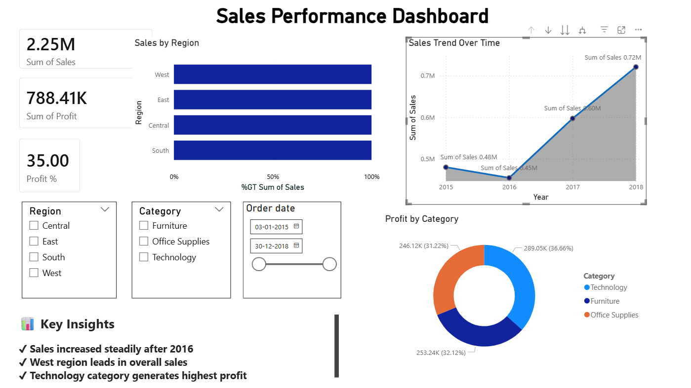

# 📊 Sales Performance Dashboard (Power BI)

## 🔍 Overview
This project focuses on analyzing sales data to uncover trends, patterns, and business insights using Power BI.

## 🚀 Features
- KPI Metrics (Total Sales, Profit, Profit %)
- Sales Trend Analysis (Year-wise)
- Region-wise Sales Comparison
- Category-wise Profit Distribution
- Interactive Filters (Region, Category, Date)

## 🛠 Tools Used
- Power BI
- Excel

## 📈 Key Insights
- Sales increased steadily after 2016
- West region contributes the highest sales
- Technology category generates maximum profit
- Profit margins vary across categories

## 📸 Dashboard Preview

## 📌 Note
Cost was assumed as a percentage of sales to calculate profit for analysis purposes.
